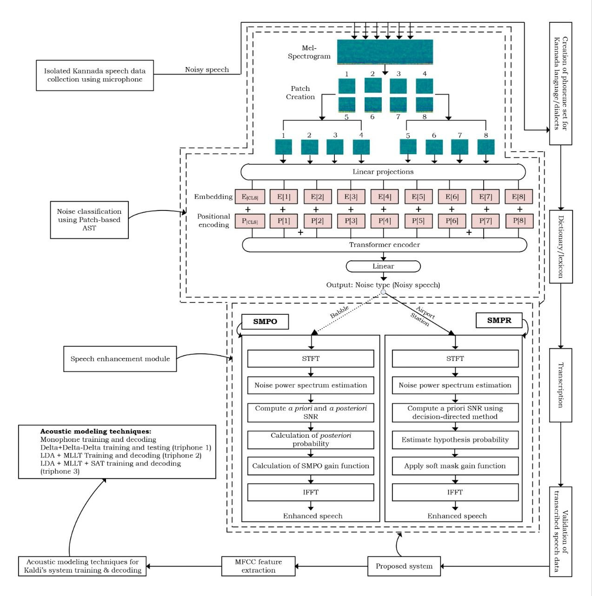

# BGN_TRY_RGP_Noise-Aware-ASR

Noise-Aware Automatic Speech Recognition for Isolated Kannada Speech

## 📌 Overview

Automatic Speech Recognition (ASR) systems often degrade in real-world environments due to background noise, reverberation, and channel distortions-especially for low-resource languages like Kannada.
This repository implements a noise-aware ASR framework that integrates:

✅ Noise classification using a Patch-based Audio Spectrogram Transformer (AST)

✅ Statistical speech enhancement using MSS-SMPO and MSS-SMPR methods

✅ Kaldi-based acoustic modeling for robust ASR

✅ Evaluation using WER and classification metrics

The system improves robustness under severe noise conditions by first identifying the noise type, then enhancing speech accordingly, and finally performing ASR.

---

## 🧠 Proposed System Architecture

The overall pipeline consists of:

  1. Noisy speech input

  2. Mel-spectrogram + patch creation

  3. Patch-based AST for noise classification

  4. Noise-specific speech enhancement

    - MSS-SMPO

    - -SMPR

  5. MFCC feature extraction

  6. Kaldi acoustic model training & decoding

  7. ASR output + WER evaluation

## 📷 Refer to the architecture diagram in the repository for the full pipeline.



---

## 📂 Repository Structure

```text
BGN_TRY_RGP_Noise-Aware-ASR/
│
├── Noise-Classification.ipynb         # AST-based noise classification training/inference
├── Noise_Classification-EDA.ipynb     # Exploratory data analysis for noise data
├── mss_smpo.m                         # MSS-SMPO speech enhancement (MATLAB)
├── mss_smpr.m                         # MSS-SMPR speech enhancement (MATLAB)
├── addnoise_asl.m                     # Add noise to clean speech (MATLAB)
├── addnoise_asl_batch_process.m
├── addnoise_asl_batch_process_noskiping.m
├── noise-add-snr.py                   # Add noise at different SNR levels (Python)
├── confusion_matrix.py                # Plot confusion matrix for classification
├── WER_extractor.py                   # Compute Word Error Rate (WER)
├── file-renaming.py                   # Utility script for renaming files
├── folder-rename.py                   # Utility script for renaming folders
├── file-structure.py                  # Dataset structure utility
├── run.sh                             # Helper shell script
├── README.md                          # Project documentation
└── LICENSE
```

---

## ⚙️ Requirements

### Python (for noise classification & evaluation)

Python 3.8+

numpy

pandas

librosa

matplotlib

scikit-learn

torch 

jupyter

### MATLAB (for speech enhancement)

MATLAB R2020+ recommended

Signal Processing Toolbox

### Kaldi (for ASR backend)

Kaldi toolkit installed and configured

Standard Kaldi Kannada ASR setup (included run script in this repo, language modelling needed to be included in the work to reproduce)


